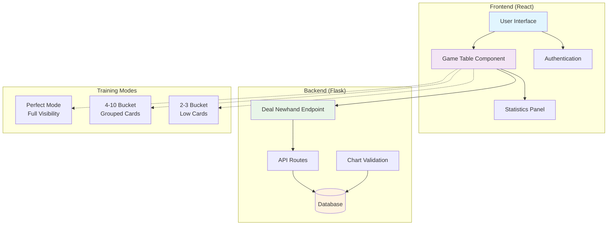
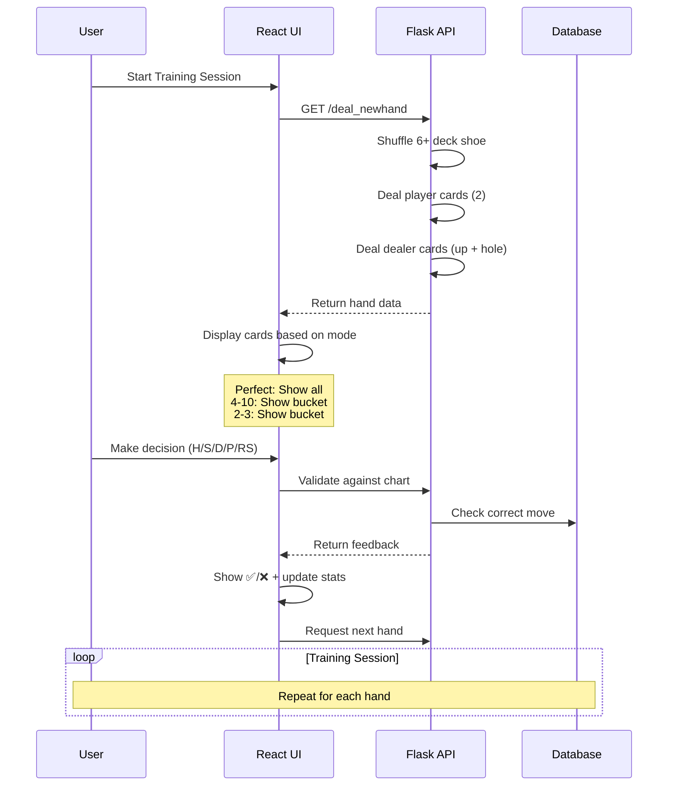
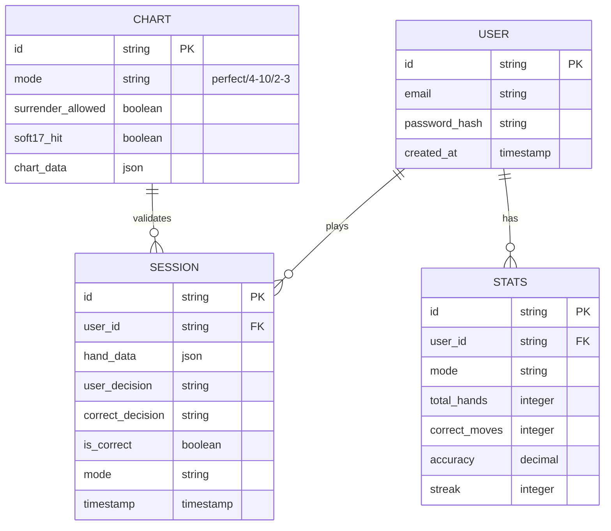
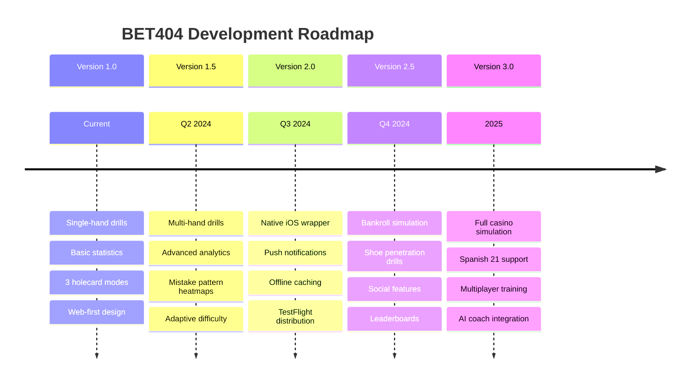

# 🃏 BET404 - Holecarding Blackjack Training App

[](https://github.com/yourusername/bet404)
[](https://reactjs.org/)
[](https://flask.palletsprojects.com/)
[](LICENSE)

> **A professional-grade single-hand blackjack training tool focused exclusively on holecarding techniques**

BET404 eliminates full gameplay loops and bankroll management, targeting rapid drill and grading of each decision. Train like a pro with immediate feedback and comprehensive statistics tracking.

---

## 🎯 **Key Features**

### 🚀 **One-Hand Drill System**
- Every iteration deals exactly **one hand** and auto-reshuffles 6+ decks
- No bankroll management or multi-hand complexity
- Pure focus on decision-making accuracy

### ⚡ **Immediate Grading**
- Each decision (Hit, Stand, Double, Split, Surrender) scored **instantly**
- Real-time feedback with ✅ or ❌ indicators
- Lifetime and session statistics tracking

### 🎛️ **Mode Flexibility**
- Toggle holecard visibility mid-session
- Switch between Perfect, 4-10 Bucket, and 2-3 Bucket modes
- Adjust rule variants on-the-fly

---

## 🏗️ **Architecture Overview**



## 🎮 **Training Flow**



## 🔧 **Holecard Visibility Modes**

```mermaid
graph LR
    subgraph "Training Modes"
        A[Perfect Mode] --> A1[Exact dealer<br/>hole cards face-up]
        B[Bucket 4-10] --> B1[Hole cards shown<br/>as "4-10" bucket]
        C[Bucket 2-3] --> C1[Hole cards shown<br/>as "2-3" bucket]
    end
    
    subgraph "Backend Storage"
        A1 --> CHARTS[12 Chart Variants<br/>3 modes × 2 surrender × 2 soft17]
        B1 --> CHARTS
        C1 --> CHARTS
    end
    
    style A fill:#4caf50
    style B fill:#ff9800
    style C fill:#f44336
    style CHARTS fill:#9c27b0
```

---

## 🚀 **Quick Start**

### Prerequisites
- Node.js 16+ 
- Python 3.8+
- npm or yarn

### Installation

1. **Clone the repository**
   ```bash
   git clone https://github.com/yourusername/bet404.git
   cd bet404
   ```

2. **Setup Frontend**
   ```bash
   cd frontend
   npm install
   npm start
   ```

3. **Setup Backend**
   ```bash
   cd backend
   pip install -r requirements.txt
   python app.py
   ```

4. **Environment Setup**
   ```bash
   # Create .env file
   cp .env.example .env
   # Configure your database and auth settings
   ```

### 🎯 **Usage**

1. **Create Account** - Sign up with email/password
2. **Choose Settings** - Select holecard mode, surrender rules, soft 17 handling
3. **Start Training** - Begin single-hand drills with immediate feedback
4. **Track Progress** - Monitor accuracy and improvement over time

---

## 📊 **Data Models**



## 🎛️ **Configuration Options**

### Rule Variants (12 Total Combinations)
| Dimension | Options |
|-----------|---------|
| **Holecard Visibility** | Perfect, 4-10, 2-3 |
| **Surrender Allowed** | Yes, No |
| **Dealer Soft 17** | Hit, Stand |

### Session Settings
- **Deck Count**: Fixed at 6+ (auto-reshuffle)
- **Surrender Toggle**: Enable/disable mid-session
- **Soft 17 Rule**: Hit or Stand
- **Holecard Mode**: Switch between visibility modes

---

## 🧪 **API Endpoints**

### 🃏 **Deal New Hand**
```http
GET /api/deal_newhand
```

**Response:**
```json
{
  "player_cards": [
    {"suit": "hearts", "rank": "A"},
    {"suit": "spades", "rank": "K"}
  ],
  "dealer_cards": [
    {"suit": "diamonds", "rank": "7"},
    {"hole_bucket": "4-10"}
  ],
  "settings": {
    "hole_mode": "4-10",
    "surrender_allowed": true,
    "soft17_hit": false,
    "decks_count": 6,
    "double_first_two": "any"
  }
}
```

### 📈 **Validation Flow**
```http
POST /api/validate_move
Content-Type: application/json

{
  "player_cards": [...],
  "dealer_upcard": {...},
  "hole_info": {...},
  "user_decision": "H",
  "settings": {...}
}
```

---

## 📱 **UI Components**

### 🎮 **Game Table**
- **Dealer Area**: Upcard + holecard info per mode
- **Player Area**: Two upcards + action buttons
- **Feedback**: Real-time correct/incorrect overlay
- **Stats Panel**: Current session accuracy

### 📊 **Statistics Dashboard**
- Lifetime accuracy across all modes
- Per-mode performance breakdown
- Current streak tracking
- Hands played counter

### ⚙️ **Settings Panel**
- Holecard visibility mode selector
- Rule variant toggles
- Chart upload functionality (admin)
- Session preferences

---

## 🔮 **Future Roadmap**



---

## 🛠️ **Development**

### Project Structure
```
bet404/
├── frontend/                 # React application
│   ├── src/
│   │   ├── components/      # React components
│   │   ├── hooks/          # Custom hooks
│   │   └── utils/          # Utility functions
├── backend/                 # Flask API
│   ├── api/                # API blueprints
│   ├── models/             # Database models
│   └── utils/              # Backend utilities
├── docs/                   # Documentation
└── tests/                  # Test suites
```

### 🧪 **Testing**
```bash
# Frontend tests
cd frontend && npm test

# Backend tests  
cd backend && python -m pytest

# E2E tests
npm run test:e2e
```

### 🚀 **Deployment**
```bash
# Build frontend
npm run build

# Deploy to production
docker-compose up -d
```

---

## 🤝 **Contributing**

We welcome contributions! Please see our [Contributing Guide](CONTRIBUTING.md) for details.

1. Fork the repository
2. Create your feature branch (`git checkout -b feature/AmazingFeature`)
3. Commit your changes (`git commit -m 'Add some AmazingFeature'`)
4. Push to the branch (`git push origin feature/AmazingFeature`)
5. Open a Pull Request

---

## 📄 **License**

This project is licensed under the MIT License - see the [LICENSE](LICENSE) file for details.

---

## 🙏 **Acknowledgments**

- **Blackjack Strategy**: Built on decades of mathematical analysis
- **Holecarding Techniques**: Advanced card counting methodologies  
- **UI/UX Design**: Modern web standards for professional training tools
- **Community**: Feedback from professional blackjack players and trainers

---

<div align="center">

**Made with ❤️ for professional blackjack training**

[📧 Contact](mailto:contact@bet404.com) • [🐛 Report Bug](https://github.com/yourusername/bet404/issues) • [💡 Request Feature](https://github.com/yourusername/bet404/issues)

</div>